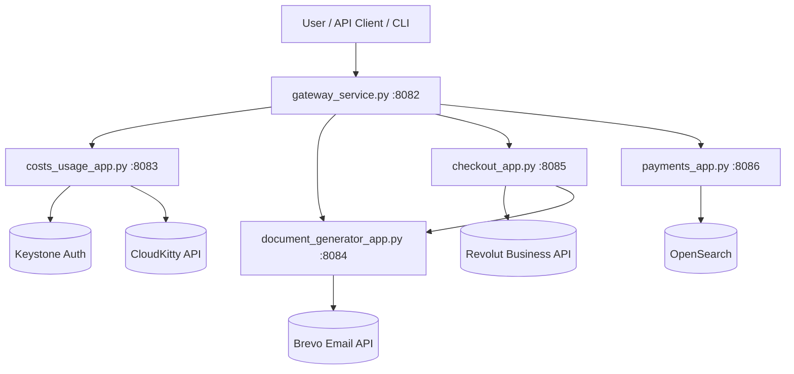

# Architecture Overview

This repository is organized as a small microservice platform for FinOps use cases (cost visibility, billing documents, checkout, and payment tracking).

## System Topology

## Components and Responsibilities

- **Gateway (`gateway_service.py`)**
  - Public entrypoint.
  - Performs path-based reverse proxy routing to internal services.
  - Exposes `/healthz` for service readiness checks.

- **Costs/Usage service (`costs_usage_app.py`)**
  - Serves project cost APIs and web UI/static assets.
  - Integrates with OpenStack Keystone + CloudKitty for rating/cost data.

- **Document Generator (`document_generator_app.py`)**
  - Manages invoice and receipt generation.
  - Returns file responses (PDF/HTML preview behavior) for invoices and receipts.
  - Sends generated documents via Brevo when requested.

- **Checkout service (`checkout_app.py`)**
  - Creates Revolut orders for invoice checkout links.
  - Pulls invoice data from Document Generator before calling Revolut.

- **Payments service (`payments_app.py`)**
  - Stores and serves payment ledger records using OpenSearch.

## Network Model

Docker Compose runs all services with `network_mode: host`, with fixed local ports:

- `gateway`: `8082`
- `costs_usage`: `8083`
- `document_generator`: `8084`
- `checkout`: `8085`
- `payments`: `8086`

Because the gateway is the unified entrypoint, clients should primarily talk to `http://localhost:8082`.
