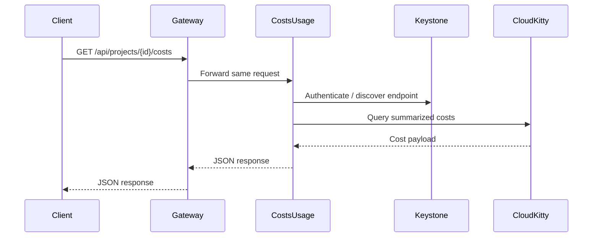
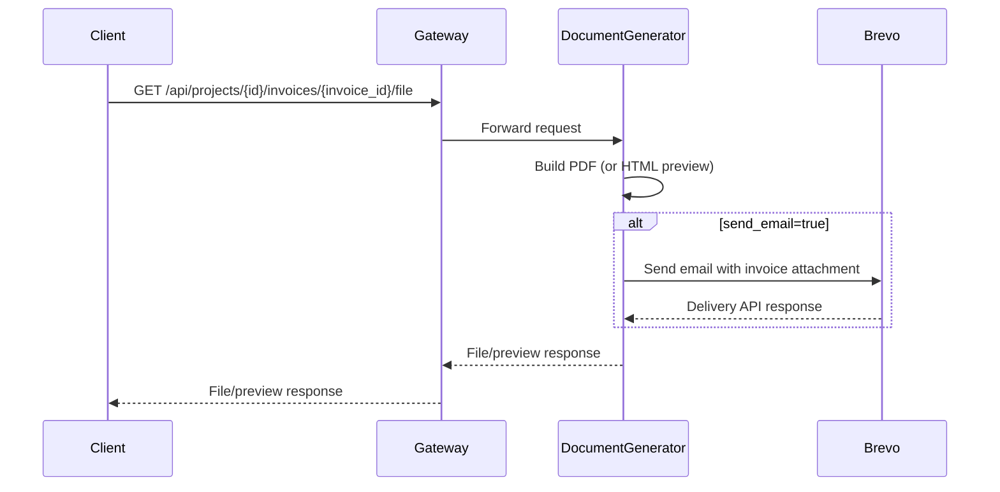
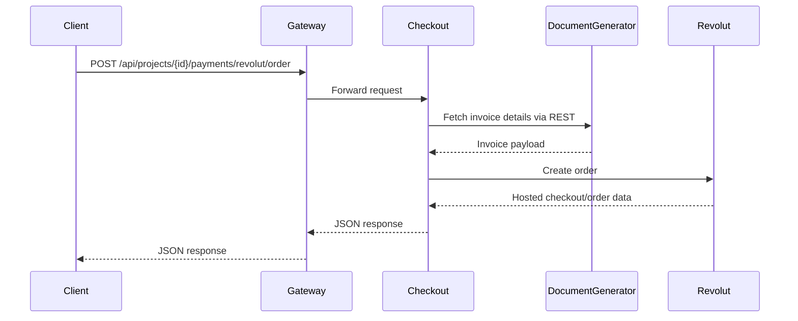
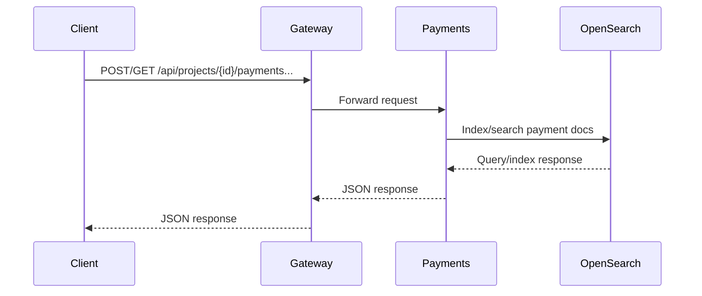

# Request Flows Between Systems

This document captures end-to-end request flows for common operations.

## 1) Retrieve project costs

## 2) Generate invoice file (with optional email)

## 3) Create Revolut checkout order

## 4) Record/lookup payments

## Operational Notes

- Gateway remains stateless and forwards headers/body with response passthrough.
- Downstream failures are surfaced as gateway upstream errors (`502` for connectivity issues).
- Service-level health checks are integral to startup validation in the microservice setup.
