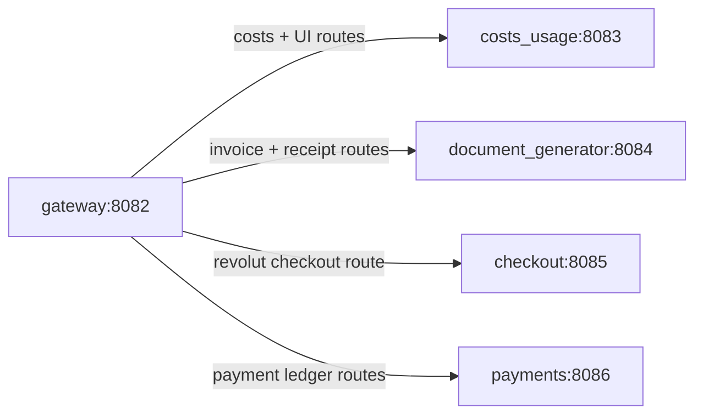

# Gateway Routing and Service Boundaries

This document describes how incoming HTTP paths are mapped by the gateway to internal backend services.

## Route Mapping

| Incoming Path Pattern | Routed Service | Notes |
|---|---|---|
| `/healthz` | Gateway itself | Health check handled directly by gateway. |
| `/` and `/static/*` | `costs_usage` | UI HTML, JS, CSS, and related assets. |
| `/api/projects/<project_id>/costs*` | `costs_usage` | Cost aggregate, monthly and graph endpoints. |
| `/api/projects/<project_id>/payments/revolut/order` | `checkout` | Dedicated checkout endpoint for Revolut order creation. |
| `/api/projects/<project_id>/invoices*` | `document_generator` | Invoice create/read/file endpoints. |
| `/api/projects/<project_id>/receipts*` | `document_generator` | Receipt create/read/file endpoints. |
| `/api/projects/<project_id>/payments*` (except the Revolut order route) | `payments` | Payment ledger endpoints backed by OpenSearch. |

Any path that does not match a known rule returns `404` from gateway.

## Internal Connectivity

## Startup Dependencies and Health Checks

The gateway validates required upstream URLs at startup and checks each upstream `/healthz` endpoint before serving traffic. This prevents partially configured gateway starts in Compose/local environments.

## Design Implications

- **Single public API base URL:** clients only need the gateway address.
- **Service isolation:** each domain can scale and evolve independently.
- **Clear ownership boundaries:** billing docs, checkout, payments, and cost usage logic stay separated.
